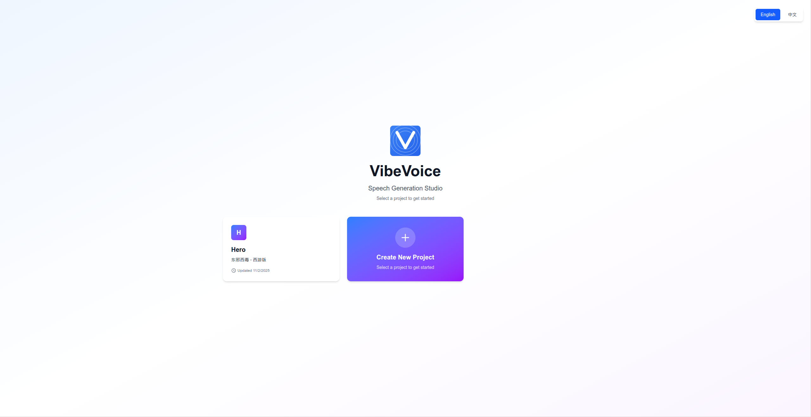
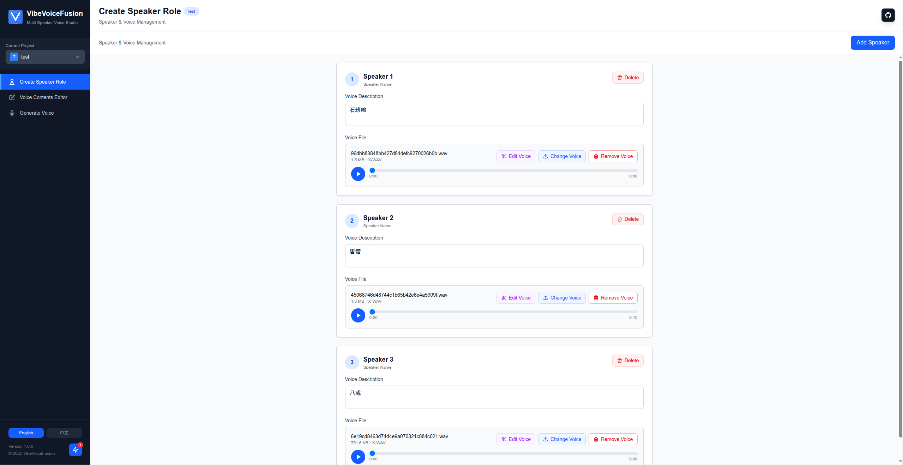
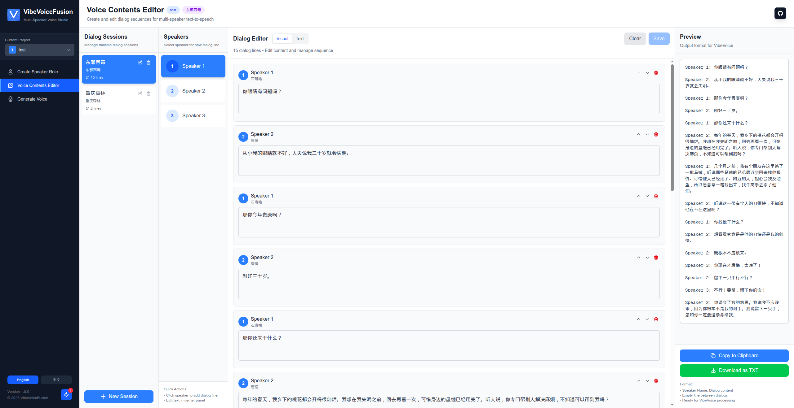
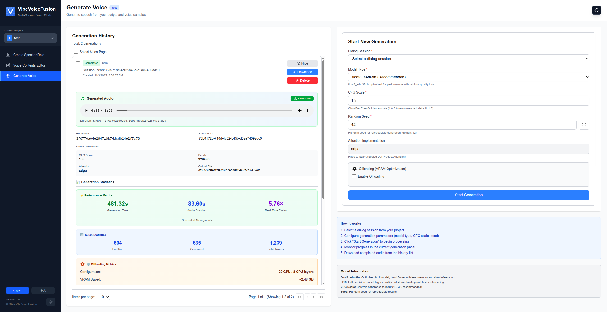
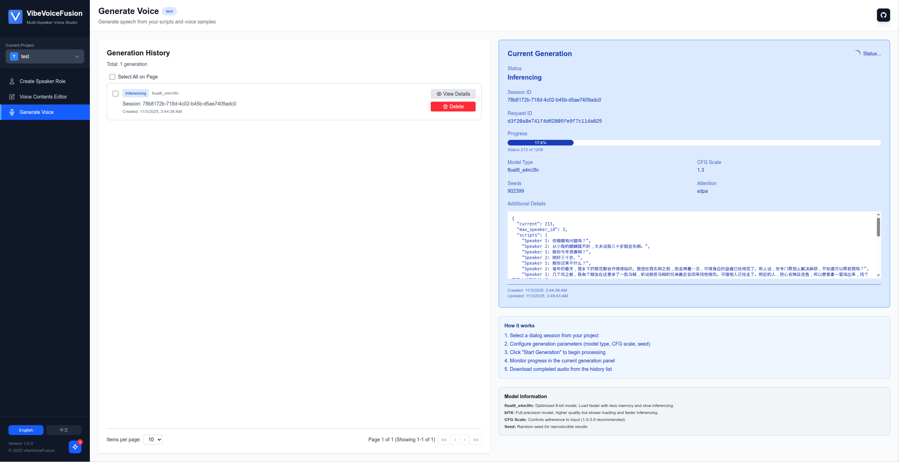

# VibeVoiceFusion

<div align="center">


**A Complete Web Application for Multi-Speaker Voice Generation**

*Built on Microsoft's VibeVoice Model*

[](LICENSE)
[](https://www.python.org/)
[](https://www.typescriptlang.org/)
[](Dockerfile)
[](https://hub.docker.com/r/zhaokundev/vibevoicefusion)
[](https://hub.docker.com/r/zhaokundev/vibevoicefusion)
[](https://hub.docker.com/r/zhaokundev/vibevoicefusion)

[English](README.md) | [简体中文](README_zh.md)

[Features](#features) • [Demo Samples](#demo-samples) • [Get Started](#get-started) • [Documentation](#documentation) • [Community](#community) • [Contributing](#contributing)

</div>

---

## Overview

### Purpose

VibeVoiceFusion is a **web application** for generating high-quality, multi-speaker synthetic speech with voice cloning capabilities. Built on Microsoft's VibeVoice model (AR + diffusion architecture), this project provides a complete full-stack solution with an intuitive user interface, project management, and advanced VRAM optimization features.

**Key Goals:**
- Provide a user-friendly interface for voice generation without requiring coding knowledge
- Enable efficient multi-speaker dialog synthesis with distinct voice characteristics
- Optimize memory usage for consumer-grade GPUs (10GB+ VRAM)
- Support bilingual workflows (English/Chinese)
- Offer both web UI and CLI interfaces for different use cases

### Principle

VibeVoice combines **autoregressive (AR)** and **diffusion** techniques for text-to-speech synthesis:

1. **Text Processing**: Input text is tokenized and processed through a Qwen-based language model backbone
2. **Voice Encoding**: Reference voice samples are encoded into acoustic and semantic embeddings
3. **AR Generation**: The model autoregressively generates speech tokens conditioned on text and voice embeddings
4. **Diffusion Refinement**: A DPM-Solver-based diffusion head converts tokens to high-quality audio waveforms
5. **Voice Cloning**: The unified processor preserves speaker characteristics from reference audio samples

**Technical Highlights:**
- **Model Architecture**: Qwen backbone + VAE acoustic tokenizer + semantic encoder + diffusion head
- **Quantization**: Float8 (FP8 E4M3FN) support for ~50% VRAM reduction with minimal quality loss
- **Layer Offloading**: Dynamic CPU/GPU memory management for running on limited VRAM
- **Attention Mechanism**: PyTorch native SDPA for maximum compatibility

### Features

#### Complete Web Application

- **Project Management**: Organize voice generation projects with metadata and descriptions
- **Speaker/Voice Management**:
  - Upload and manage reference voice samples (WAV, MP3, M4A, FLAC, WebM)
  - Audio preview with playback controls
  - Voice file replacement with automatic cache-busting
  - Audio trimming functionality
- **Dialog Editor**:
  - Visual editor with drag-and-drop line reordering
  - Text editor mode for bulk editing
  - Support for multi-speaker dialogs (up to 4+ speakers)
  - Real-time preview and validation
- **Generation System**:
  - Queue-based task management (prevents GPU conflicts)
  - Real-time progress monitoring with live updates
  - Configurable parameters (CFG scale, random seed, model precision)
  - Generation history with filtering, sorting, and pagination
  - Audio playback and download for completed generations

#### VRAM Optimization

- **Layer Offloading**: Move transformer layers between CPU/GPU to reduce VRAM requirements
  - **Balanced** (12 GPU / 16 CPU layers): ~5GB VRAM savings, ~2.0x slower - RTX 3060 16GB, 4070
  - **Aggressive** (8 GPU / 20 CPU layers): ~6GB VRAM savings, ~2.5x slower - RTX 3060 12GB, 4060
  - **Extreme** (4 GPU / 24 CPU layers): ~7GB VRAM savings, ~3.5x slower - RTX 3060 10GB (minimum)
- **Float8 Quantization**: Reduce model size from ~14GB to ~7GB with comparable quality. (Supported by RTX 40 series and above graphics cards.)
- **Adaptive Configuration**: Automatic VRAM estimation and optimal layer distribution

**VRAM Requirements:**

| Configuration | GPU Layers | VRAM Usage | Speed | Target Hardware |
|--------------|-----------|------------|-------|-----------------|
| No offloading | 28 | 11-14GB | 1.0x | RTX 4090, A100, 3090 |
| Balanced | 12 | 6-8GB | 0.70x | RTX 4070, 3080 16GB |
| Aggressive | 8 | 5-7GB | 0.55x | RTX 3060 12GB |
| Extreme | 4 | 4-5GB | 0.40x | RTX 3080 10GB |

> Float8 Quantization only supports by RTX 40XX or 50XX serial nvidia card.

#### Internationalization

- **Full Bilingual Support**: Complete English/Chinese UI with 360+ translation keys
- **Auto-Detection**: Automatically detects browser language on first visit
- **Persistent Preference**: Language selection saved in localStorage
- **Backend i18n**: API error messages and responses translated to user's language

#### Docker Deployment

- **Multi-Stage Build**: Optimized Dockerfile with frontend build, Python venv, and model download
- **Self-Contained**: Clones from GitHub and builds entirely from source
- **HuggingFace Integration**: Automatically downloads model file (~3-4GB) during build

#### Additional Features

- **Responsive Design**: Mobile-friendly interface with Tailwind CSS
- **Real-Time Updates**: WebSocket-free polling with smart update intervals (2s active, 60s background)
- **Audio Cache-Busting**: Ensures audio updates are immediately reflected
- **Toast Notifications**: User-friendly feedback for all operations
- **Dark Mode Ready**: Modern UI with consistent styling
- **Accessibility**: Keyboard navigation and ARIA labels

---

## Demo Samples

Listen to voice generation samples created with VibeVoiceFusion. Click the links below to download and play:

### Single Speaker

**🎧 [Pandora's Box Story (BFloat16 Model)](https://raw.githubusercontent.com/zhao-kun/VibeVoiceFusion/main/demo/outputs/1p_pandora_box_bf16.wav)**

*Generated with bfloat16 precision model - Full quality, 14GB VRAM*

**🎧 [Pandora's Box Story (Float8 Model)](https://raw.githubusercontent.com/zhao-kun/VibeVoiceFusion/main/demo/outputs/1p_pandora_box_float8_e4m3fn.wav)**

*Generated with float8 quantization - Optimized for 7GB VRAM with comparable quality*

### Multi-Speaker (3 Speakers)

**🎭 [东邪西毒 - 西游版 (Journey to the West Version)](https://raw.githubusercontent.com/zhao-kun/VibeVoiceFusion/main/demo/outputs/东邪西毒-西游版.wav)**

*Multi-speaker dialog with distinct voice characteristics for each character*

---

## Get Started

### Prerequisites

- **Python**: 3.9 or higher
- **Node.js**: 16.x or higher (for frontend development)
- **CUDA**: Compatible GPU with CUDA support (recommended)
- **VRAM**: Minimum 6GB for extreme offloading, 14GB recommended for best performance
- **Docker**: Optional, for containerized deployment

### Installation

#### Option 1: Docker (Recommended for Production)

Build docker image 
```bash
# Clone the repository
git clone https://github.com/zhao-kun/vibevoicefusion.git
cd vibevoicefusion
# Build and the docker image
docker compose build vibevoice
```

After build successfully, run command:

```bash
docker run -d \
  --name vibevoicefusion \
  --gpus all \
  -p 9527:9527 \
  -v $(pwd)/workspace:/workspace/zhao-kun/vibevoice/workspace \
  zhaokundev/vibevoicefusion:latest
```

Access the application at `http://localhost:9527`

**The Docker image is available on Docker Hub, and you can launch VibeVoiceFusion using the following command.**

```bash
docker pull zhaokundev/vibevoicefusion
docker run -d \
  --name vibevoicefusion \
  --gpus all \
  -p 9527:9527 \
  -v $(pwd)/workspace:/workspace/zhao-kun/vibevoice/workspace \
  zhaokundev/vibevoicefusion:latest
```

**Build Time**: 18-28 minutes | **Image Size**: ~12-15GB

#### Option 2: Manual Installation

**1. Install Backend Dependencies**

```bash
# Clone the repository
git clone https://github.com/zhao-kun/vibevoice.git
cd vibevoice

# Install Python package
pip install -e .
```

**2. Download Pre-trained Model**

Download from HuggingFace (choose one):
- **Float8 (Recommended)**: [vibevoice7b_float8_e4m3fn.safetensors](https://huggingface.co/zhaokun/vibevoice-large/blob/main/vibevoice7b_float8_e4m3fn.safetensors) (~7GB) (Supported by RTX 40 series and above graphics cards.)
- **BFloat16 (Full Precision)**: [vibevoice7b_bf16.safetensors](https://huggingface.co/zhaokun/vibevoice-large/blob/main/vibevoice7b_bf16.safetensors) (~14GB)
- **Config**: [config.json](https://huggingface.co/zhaokun/vibevoice-large/blob/main/config.json)

Place files in `./models/vibevoice/`

**3. Install Frontend Dependencies** (for development)

```bash
cd frontend
npm install
```

**4. Build Frontend** (for production)

```bash
cd frontend
npm run build
cp -r out/* ../backend/dist/
```

### Usage

#### Web Application (Recommended)

**Production Mode** (single server):
```bash
# Start backend server (serves both API and frontend)
python backend/run.py

# Access at http://localhost:9527
```

**Development Mode** (separate servers):
```bash
# Terminal 1: Start backend API
python backend/run.py  # http://localhost:9527

# Terminal 2: Start frontend dev server
cd frontend
npm run dev  # http://localhost:3000
```

### Complete Workflow Guide

This guide walks you through the complete process of creating multi-speaker voice generation from start to finish.

#### Step 1: Create a Project

Start by creating a new project or selecting an existing one. Projects help organize your voice generation work with metadata and descriptions.

<div align="center">

<p><i>Create and manage projects from the home page</i></p>
</div>

**Actions:**
- Click "Create New Project" card
- Enter a project name (e.g., "Podcast Episode 1")
- Optionally add a description
- Click "Create Project"

The project will be automatically selected and you'll be navigated to the Speaker Role page.

#### Step 2: Add Speakers and Upload Voice Samples

Upload reference voice samples for each speaker. The system supports various audio formats (WAV, MP3, M4A, FLAC, WebM).

<div align="center">

<p><i>Upload and manage voice samples for each speaker</i></p>
</div>

**Actions:**
- Click "Add New Speaker" button
- The speaker will be automatically named (e.g., "Speaker 1", "Speaker 2")
- Click "Upload Voice" to select a reference audio file (3-30 seconds recommended)
- Preview the uploaded voice using the audio player
- Repeat for additional speakers (supports 2-4+ speakers)

**Tips:**
- Use clean audio with minimal background noise
- 5-15 seconds of speech is ideal for voice cloning
- Each speaker needs a unique voice sample
- You can replace voice files later by clicking "Change Voice"

#### Step 3: Create and Edit Dialog

Create a dialog session and write the multi-speaker conversation. The dialog editor supports drag-and-drop reordering and real-time preview.

<div align="center">

<p><i>Multi-speaker dialog editor with visual and text modes</i></p>
</div>

**Actions:**
- Click "Create New Session" in the session list
- Enter a session name (e.g., "Chapter 1")
- In the dialog editor, add lines for each speaker:
  - Select a speaker from the dropdown
  - Enter the dialog text
  - Click "Add Line" or press Enter
- Reorder lines by dragging the handle icons
- Use "Text Editor" mode for bulk editing
- Click "Save" to persist your changes

**Dialog Format (Text Mode):**
```
Speaker 1: Welcome to our podcast!

Speaker 2: Thanks for having me. It's great to be here.

Speaker 1: Let's dive into today's topic.
```

**Features:**
- Visual editor with drag-and-drop
- Text editor for bulk editing
- Real-time preview
- Copy and download functionality
- Format validation

#### Step 4: Generate Voice

Configure generation parameters and start the voice synthesis process. Monitor real-time progress and manage generation history.

<div align="center">

<p><i>Generation interface with parameters, live progress, and history</i></p>
</div>

**Actions:**
- Navigate to "Generate Voice" page
- Select a dialog session from the dropdown
- Configure parameters:
  - **Model Type**:
    - `float8_e4m3fn` (recommended): 7GB VRAM, faster loading
    - `bfloat16`: 14GB VRAM, full precision
  - **CFG Scale** (1.0-2.0): Controls generation adherence to text
    - Lower (1.0-1.3): More natural, varied
    - Higher (1.5-2.0): More controlled, may sound robotic
    - Default: 1.3
  - **Random Seed**: Any positive integer for reproducibility
  - **Offloading** (optional): Enable if VRAM < 14GB
    - **Balanced**: 12 GPU layers, ~5GB savings, 2.0x slower (RTX 3070 12GB, 4070)
    - **Aggressive**: 8 GPU layers, ~6GB savings, 2.5x slower (RTX 3080 12GB)
    - **Extreme**: 4 GPU layers, ~7GB savings, 3.5x slower (minimum 10GB VRAM)
- Click "Start Generation"

**Real-Time Monitoring:**
- Progress bar shows completion percentage
- Phase indicators: Preprocessing → Inferencing → Saving
- Live token generation count
- Estimated time remaining

<div align="center">

<p><i>Generation interface with parameters, live progress, and history</i></p>
</div>

**Generation History:**
- View all past generations with status (completed, failed, running)
- Filter and sort by date, status, or session
- Play generated audio inline
- Download WAV files
- Delete unwanted generations
- View detailed metrics (tokens, duration, RTF, VRAM usage)

#### Command-Line Interface

For CLI-based generation without the web UI:

```bash
python demo/local_file_inference.py \
    --model_file ./models/vibevoice/vibevoice7b_float8_e4m3fn.safetensors \
    --txt_path demo/text_examples/1p_pandora_box.txt \
    --speaker_names zh-007 \
    --output_dir ./outputs \
    --dtype float8_e4m3fn \
    --cfg_scale 1.3 \
    --seed 42
```

**CLI Arguments:**
- `--model_file`: Path to model `.safetensors` file
- `--config`: Path to `config.json` (optional)
- `--txt_path`: Input text file with speaker-labeled dialog
- `--speaker_names`: Speaker name(s) for voice file mapping
- `--output_dir`: Output directory for generated audio
- `--device`: `cuda`, `mps`, or `cpu` (auto-detected)
- `--dtype`: `float8_e4m3fn` or `bfloat16`
- `--cfg_scale`: Classifier-Free Guidance scale (default: 1.3)
- `--seed`: Random seed for reproducibility

### Configuration

#### Backend Configuration

Environment variables (optional):
```bash
export WORKSPACE_DIR=/path/to/workspace  # Default: ./workspace
export FLASK_DEBUG=False  # Production mode
```

#### Frontend Configuration

Development API URL (`frontend/.env.local`):
```bash
NEXT_PUBLIC_API_URL=http://localhost:9527/api/v1
```

---

## Documentation

### Architecture Overview

```
vibevoice/
├── backend/                 # Flask API server
│   ├── api/                # REST API endpoints
│   │   ├── projects.py     # Project CRUD
│   │   ├── speakers.py     # Speaker management
│   │   ├── dialog_sessions.py  # Dialog CRUD
│   │   └── generation.py   # Voice generation
│   ├── services/           # Business logic layer
│   ├── models/             # Data models
│   ├── gen_voice/          # Background task queue
│   ├── inference/          # Inference engine
│   ├── i18n/              # Backend translations
│   └── dist/              # Frontend static files (production)
├── frontend/               # Next.js web application
│   ├── app/               # Next.js app router pages
│   │   ├── page.tsx       # Home/Project selector
│   │   ├── speaker-role/  # Speaker management
│   │   ├── voice-editor/  # Dialog editor
│   │   └── generate-voice/ # Generation page
│   ├── components/        # React components
│   ├── lib/              # Context providers & utilities
│   │   ├── ProjectContext.tsx
│   │   ├── SessionContext.tsx
│   │   ├── SpeakerRoleContext.tsx
│   │   ├── GenerationContext.tsx
│   │   ├── GlobalTaskContext.tsx
│   │   ├── i18n/         # Frontend translations
│   │   └── api.ts        # API client
│   └── types/            # TypeScript type definitions
└── vibevoice/            # Core inference library
    ├── modular/          # Model implementations
    │   ├── custom_offloading_utils.py  # Layer offloading
    │   └── adaptive_offload.py         # Auto VRAM config
    ├── processor/        # Input processing
    └── schedule/         # Diffusion scheduling
```

### API Reference

All endpoints prefixed with `/api/v1`:

#### Projects
- `GET /projects` - List all projects
- `POST /projects` - Create new project
- `GET /projects/:id` - Get project details
- `PUT /projects/:id` - Update project
- `DELETE /projects/:id` - Delete project

#### Speakers
- `GET /projects/:id/speakers` - List speakers
- `POST /projects/:id/speakers` - Add speaker (multipart: description, voice_file)
- `PUT /projects/:id/speakers/:speaker_id` - Update speaker metadata
- `PUT /projects/:id/speakers/:speaker_id/voice` - Replace voice file
- `DELETE /projects/:id/speakers/:speaker_id` - Delete speaker

#### Dialog Sessions
- `GET /projects/:id/sessions` - List sessions
- `POST /projects/:id/sessions` - Create session
- `GET /projects/:id/sessions/:session_id` - Get session
- `PUT /projects/:id/sessions/:session_id` - Update session
- `DELETE /projects/:id/sessions/:session_id` - Delete session
- `GET /projects/:id/sessions/:session_id/text` - Get dialog text

#### Voice Generation
- `POST /projects/:id/generations` - Start generation
- `GET /projects/generations/current` - Get current running task
- `GET /projects/:id/generations` - List generation history
- `GET /projects/:id/generations/:request_id` - Get generation details
- `DELETE /projects/:id/generations/:request_id` - Delete generation
- `POST /projects/:id/generations/batch-delete` - Delete multiple generations

### Workspace Structure

```
workspace/
├── projects.json          # All projects metadata
└── {project-id}/
    ├── voices/
    │   ├── speakers.json  # Speaker metadata
    │   └── {uuid}.wav     # Voice files
    ├── scripts/
    │   ├── sessions.json  # Session metadata
    │   └── {uuid}.txt     # Dialog text files
    └── output/
        ├── generation.json  # Generation metadata
        └── {request_id}.wav # Generated audio files
```

### Performance Benchmarks

**RTX 4090 (24GB VRAM):**
| Configuration | VRAM | Generation Time | RTF | Quality |
|--------------|------|-----------------|-----|---------|
| BFloat16, No offload | 14GB | 15s (50s audio) | 0.30x | Excellent |
| Float8, No offload | 7GB | 16s (50s audio) | 0.32x | Excellent |

**RTX 3060 12GB:**
| Configuration | VRAM | Generation Time | RTF | Quality |
|--------------|------|-----------------|-----|---------|
| Float8, Balanced | 7GB | 30s (50s audio) | 0.60x | Excellent |
| Float8, Aggressive | 6GB | 40s (50s audio) | 0.80x | Good |

*RTF (Real-Time Factor) < 1.0 means faster than real-time*

---

## Community

### Getting Help

- **Issues**: [GitHub Issues](https://github.com/zhao-kun/vibevoice/issues) - Bug reports and feature requests
- **Discussions**: [GitHub Discussions](https://github.com/zhao-kun/vibevoice/discussions) - Questions and community support

### Showcase

Share your projects and experiences:
- **Demo Audio**: Submit your generated samples to the showcase
- **Use Cases**: Share how you're using VibeVoice
- **Improvements**: Contribute optimizations and enhancements

### Responsible AI

**Important**: This project is for **research and development** purposes only.

#### Risks
- **Deepfakes & Impersonation**: Synthetic speech can be misused for fraud or disinformation
- **Voice Cloning Ethics**: Always obtain explicit consent before cloning voices
- **Biases**: Model may inherit biases from training data
- **Unexpected Outputs**: Generated audio may contain artifacts or inaccuracies

#### Guidelines

**DO:**

- Clearly disclose when audio is AI-generated
- Obtain explicit consent for voice cloning
- Use responsibly for legitimate purposes
- Respect privacy and intellectual property
- Follow all applicable laws and regulations

**DO NOT:**

- Create deepfakes or impersonation without consent
- Spread disinformation or misleading content
- Use for fraud, scams, or malicious purposes
- Violate laws or ethical guidelines

**By using this software, you agree to use it ethically and responsibly.**

---

## Contributing

We welcome contributions from the community! Here's how you can help:

### Ways to Contribute

1. **Report Bugs**: Open an issue with detailed reproduction steps
2. **Suggest Features**: Propose new features via GitHub issues
3. **Submit Pull Requests**:
   - Fix bugs
   - Add features
   - Improve documentation
   - Add translations
4. **Improve Documentation**: Help make the project more accessible
5. **Share Use Cases**: Show how you're using VibeVoice

### Testing

```bash
# Backend tests (when available)
pytest tests/

# Frontend tests (when available)
cd frontend
npm test

# Manual testing
# 1. Create project
# 2. Add speakers
# 3. Create dialog
# 4. Generate voice
# 5. Verify output quality
```

---

## License

This project follows the same license terms as the original Microsoft VibeVoice repository. Please refer to the [LICENSE](LICENSE) file for details.

### Third-Party Licenses

- **Frontend**: React, Next.js, Tailwind CSS (MIT License)
- **Backend**: Flask, PyTorch (Various open-source licenses)
- **Model Weights**: Microsoft VibeVoice (subject to Microsoft's terms)

---

## Acknowledgments

- **Microsoft Research**: Original VibeVoice model and architecture
- **ComfyUI**: Float8 casting techniques inspiration
- **kohya-ss/musubi-tuner**: Offloading implementation reference
- **HuggingFace**: Model hosting and distribution
- **Open Source Community**: Libraries and frameworks that made this possible

---

## Citation

If you use this implementation in your research, please cite both this project and the original VibeVoice paper:

```bibtex
@software{vibevoice_webapp_2024,
  title={VibeVoice: Complete Web Application for Multi-Speaker Voice Generation},
  author={Zhao, Kun},
  year={2024},
  url={https://github.com/zhao-kun/vibevoice}
}

@article{vibevoice2024,
  title={VibeVoice: Unified Autoregressive and Diffusion for Speech Generation},
  author={Microsoft Research},
  year={2024}
}
```

---

## Troubleshooting

### CUDA Out of Memory
```bash
# Try Float8 model
--dtype float8_e4m3fn

# Enable layer offloading in web UI
# Or use CLI with manual configuration
```

### Audio Quality Issues
```bash
# Adjust CFG scale (try 1.0 - 2.0)
--cfg_scale 1.5

# Use higher precision model
--dtype bfloat16
```

### Port Already in Use
```bash
# Change port in backend/run.py
app.run(host='0.0.0.0', port=9528)
```

### Frontend Build Errors
```bash
cd frontend
rm -rf node_modules .next
npm install
npm run build
```

---

<div align="center">

**Made by the VibeVoice Community**

[Back to Top](#vibevoice)

</div>
