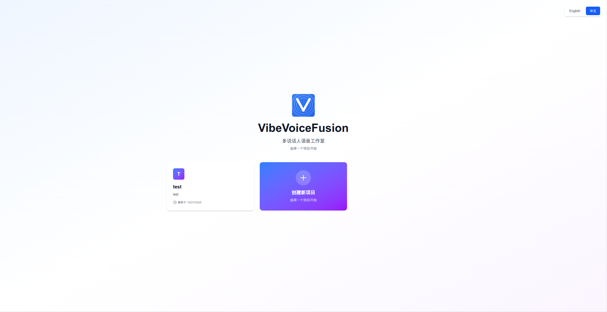
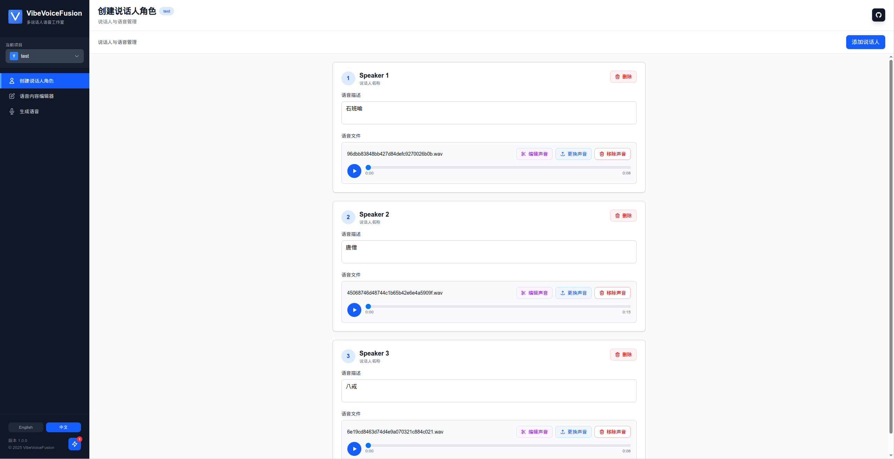
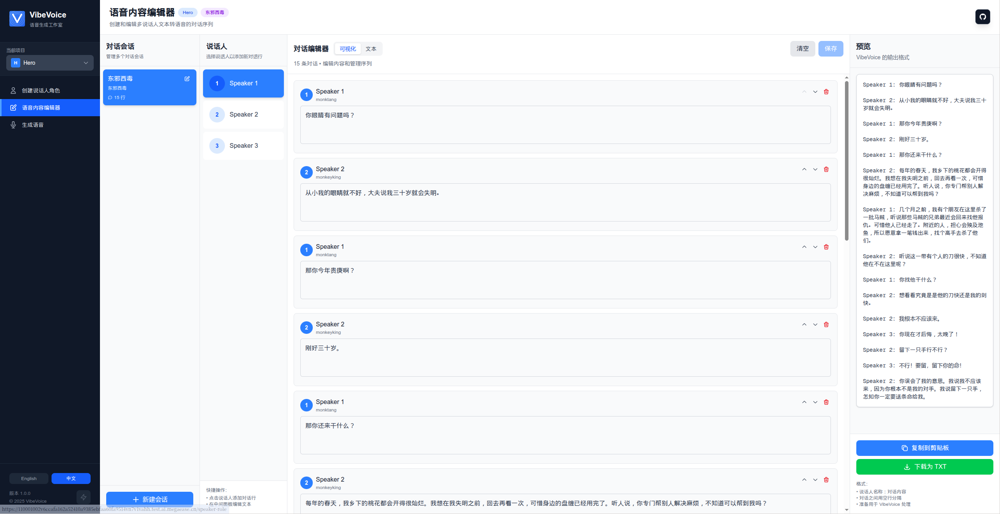
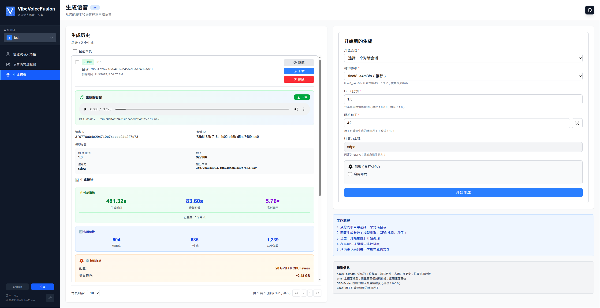

# VibeVoiceFusion

<div align="center">


**完整的多说话人语音生成 Web 应用**

*基于 Microsoft VibeVoice 模型构建*

[](LICENSE)
[](https://www.python.org/)
[](https://www.typescriptlang.org/)
[](Dockerfile)
[](https://hub.docker.com/r/zhaokundev/vibevoicefusion)
[](https://hub.docker.com/r/zhaokundev/vibevoicefusion)
[](https://hub.docker.com/r/zhaokundev/vibevoicefusion)

[English](README.md) | [简体中文](README_zh.md)

[功能特性](#功能特性) • [演示样本](#演示样本) • [快速开始](#快速开始) • [文档](#文档) • [社区](#社区) • [贡献](#贡献)

</div>

---

## 概述

### 项目目的

VibeVoiceFusion 是一个**Web 应用**，用于生成高质量、多说话人的合成语音，具备声音克隆功能。基于微软的 VibeVoice 模型（AR + 扩散架构），本项目提供完整的全栈解决方案，包含直观的用户界面、项目管理和先进的显存优化功能。

**核心目标：**

- 提供无需编程知识的友好界面进行语音生成
- 支持高效的多说话人对话合成，保持不同说话人的独特声音特征
- 优化显存使用，支持消费级 GPU（10GB+ 显存）
- 支持双语工作流（英语/中文）
- 提供 Web 界面和命令行界面以适应不同使用场景

### 技术原理

VibeVoice 结合**自回归（AR）**和**扩散**技术进行文本转语音合成：

1. **文本处理**：输入文本经过分词并通过基于 Qwen 的语言模型主干网络处理
2. **声音编码**：参考语音样本被编码为声学和语义嵌入
3. **AR 生成**：模型基于文本和声音嵌入自回归生成语音 token
4. **扩散细化**：基于 DPM-Solver 的扩散头将 token 转换为高质量音频波形
5. **声音克隆**：统一处理器从参考音频样本中保留说话人特征

**技术亮点：**

- **模型架构**：Qwen 主干网络 + VAE 声学分词器 + 语义编码器 + 扩散头
- **量化技术**：Float8 (FP8 E4M3FN) 支持，显存减少约 50%，质量损失极小
- **层卸载**：动态 CPU/GPU 内存管理，可在有限显存上运行
- **注意力机制**：PyTorch 原生 SDPA，最大化兼容性

### 功能特性

#### 完整的 Web 应用

- **项目管理**：使用元数据和描述组织语音生成项目
- **说话人/声音管理**：
  - 上传和管理参考语音样本（WAV、MP3、M4A、FLAC、WebM）
  - 音频预览与播放控制
  - 声音文件替换，自动缓存清除
  - 音频裁剪功能
- **对话编辑器**：
  - 可视化编辑器，支持拖拽重排对话行
  - 文本编辑模式用于批量编辑
  - 支持多说话人对话（最多 4+ 个说话人）
  - 实时预览和验证
- **生成系统**：
  - 基于队列的任务管理（防止 GPU 冲突）
  - 实时进度监控与动态更新
  - 可配置参数（CFG scale、随机种子、模型精度）
  - 生成历史记录，支持过滤、排序和分页
  - 完成的生成可播放和下载

#### 显存优化

- **层卸载**：在 CPU/GPU 之间移动 Transformer 层以减少显存需求
  - **平衡模式** (12 GPU / 16 CPU 层)：约 5GB 显存节省，约 2.0 倍慢 - RTX 3060 16GB、4070
  - **激进模式** (8 GPU / 20 CPU 层)：约 6GB 显存节省，约 2.5 倍慢 - RTX 3080 12GB、4060
  - **极限模式** (4 GPU / 24 CPU 层)：约 7GB 显存节省，约 3.5 倍慢 - RTX 3080 10GB（最低配置）
- **Float8 量化**：将模型大小从约 14GB 减少到约 7GB，质量相当 (RTX 40系及以上显卡支持)
- **自适应配置**：自动显存估算和最优层分配

**显存需求：**

| 配置 | GPU 层数 | 显存占用 | 速度 | 目标硬件 |
|------|---------|---------|------|---------|
| 无卸载 | 28 | 11-14GB | 1.0x | RTX 4090、A100、3090 |
| 平衡 | 12 | 6-8GB | 0.70x | RTX 4070、3080 12GB |
| 激进 | 8 | 5-7GB | 0.55x | RTX 3060 12GB |
| 极限 | 4 | 4-5GB | 0.40x | RTX 3080 10GB |

> Float8 量化，只有RTX 40系及以上显卡支持。

#### 国际化

- **完整双语支持**：完整的英文/中文界面，360+ 翻译键
- **自动检测**：首次访问自动检测浏览器语言
- **持久化偏好**：语言选择保存在 localStorage
- **后端国际化**：API 错误消息和响应翻译为用户语言

#### Docker 部署

- **多阶段构建**：优化的 Dockerfile，包含前端构建、Python venv 和模型下载
- **自包含**：从 GitHub 克隆并完全从源代码构建
- **HuggingFace 集成**：构建过程中自动下载模型文件（约 3-4GB）

#### 其他功能

- **响应式设计**：使用 Tailwind CSS 的移动友好界面
- **实时更新**：无需 WebSocket 的智能轮询更新间隔（活动时 2 秒，后台 60 秒）
- **音频缓存清除**：确保音频更新立即反映
- **Toast 通知**：所有操作的用户友好反馈
- **深色模式就绪**：现代化一致的样式
- **可访问性**：键盘导航和 ARIA 标签

---

## 演示样本

试听使用 VibeVoiceFusion 生成的语音样本。点击下方链接下载并播放：

### 单说话人

**🎧 [大话西游（BFloat16 模型）](https://raw.githubusercontent.com/zhao-kun/VibeVoiceFusion/main/demo/outputs/1p_pandora_box_bf16.wav)**

*使用 bfloat16 精度模型生成 - 完整质量，需要 14GB 显存*

**🎧 [大话西游（Float8 模型）](https://raw.githubusercontent.com/zhao-kun/VibeVoiceFusion/main/demo/outputs/1p_pandora_box_float8_e4m3fn.wav)**

*使用 float8 量化生成 - 优化至 7lGB 显存，质量相当, RTX 40系及以上显卡支持*

### 多说话人（3 个说话人）

**🎭 [东邪西毒 - 西游版](https://raw.githubusercontent.com/zhao-kun/VibeVoiceFusion/main/demo/outputs/东邪西毒-西游版.wav)**

*多说话人对话，每个角色具有独特的声音特征*

---

## 快速开始

### 前置要求

- **Python**：3.9 或更高版本
- **Node.js**：16.x 或更高版本（用于前端开发）
- **CUDA**：支持 CUDA 的 GPU（推荐）
- **显存**：极限卸载最少 6GB，推荐 14GB 以获得最佳性能
- **Docker**：可选，用于容器化部署

### 安装

#### 方式 1：Docker（生产环境推荐）

构建Docker镜像
```bash
# 克隆仓库
git clone https://github.com/zhao-kun/vibevoicefusion.git
cd vibevoicefusion

# 使用 Docker Compose 构建和运行
docker compose build vibevoice
```

运行Docker 容器

```bash
docker run -d \
  --name vibevoice \
  --gpus all \
  -p 9527:9527 \
  -v $(pwd)/workspace:/workspace/zhao-kun/vibevoice/workspace \
  zhaokundev/vibevoicefusion:latest
```

在 `http://localhost:9527` 访问应用

**Docker 镜像已经上传至Docker Hub， 你可以通过如下的命令直接启动vibevoicefusion 服务。**

```bash
docker pull zhaokundev/vibevoicefusion
docker run -d \
  --name vibevoicefusion \
  --gpus all \
  -p 9527:9527 \
  -v $(pwd)/workspace:/workspace/zhao-kun/vibevoice/workspace \
  zhaokundev/vibevoicefusion:latest
```

**构建时间**：18-28 分钟 | **镜像大小**：约 12-15GB

#### 方式 2：手动安装

**1. 安装后端依赖**

```bash
# 克隆仓库
git clone https://github.com/zhao-kun/vibevoice.git
cd vibevoice

# 安装 Python 包
pip install -e .
```

**2. 下载预训练模型**

从 HuggingFace 下载（选择其一）：

- **Float8（推荐）**：[vibevoice7b_float8_e4m3fn.safetensors](https://huggingface.co/zhaokun/vibevoice-large/blob/main/vibevoice7b_float8_e4m3fn.safetensors)（约 7GB）
- **BFloat16（全精度）**：[vibevoice7b_bf16.safetensors](https://huggingface.co/zhaokun/vibevoice-large/blob/main/vibevoice7b_bf16.safetensors)（约 14GB）
- **配置文件**：[config.json](https://huggingface.co/zhaokun/vibevoice-large/blob/main/config.json)

将文件放置在 `./models/vibevoice/` 目录

**3. 安装前端依赖**（用于开发）

```bash
cd frontend
npm install
```

**4. 构建前端**（用于生产）

```bash
cd frontend
npm run build
cp -r out/* ../backend/dist/
```

### 使用方法

#### Web 应用（推荐）

**生产模式**（单服务器）：

```bash
# 启动后端服务器（同时提供 API 和前端）
python backend/run.py

# 在 http://localhost:9527 访问
```

**开发模式**（分离服务器）：

```bash
# 终端 1：启动后端 API
python backend/run.py  # http://localhost:9527

# 终端 2：启动前端开发服务器
cd frontend
npm run dev  # http://localhost:3000
```

### 完整工作流程指南

本指南将带您完成从头到尾创建多说话人语音生成的完整过程。

#### 步骤 1：创建项目

首先创建一个新项目或选择现有项目。项目帮助您使用元数据和描述组织语音生成工作。

<div align="center">

<p><i>从主页创建和管理项目</i></p>
</div>

**操作步骤：**
- 点击"创建新项目"卡片
- 输入项目名称（例如："播客第 1 集"）
- 可选择添加描述
- 点击"创建项目"

项目将自动被选中，并导航到说话人角色页面。

#### 步骤 2：添加说话人并上传音色样本

为每个说话人上传参考音频样本。系统支持多种音频格式（WAV、MP3、M4A、FLAC、WebM）。

<div align="center">

<p><i>为每个说话人上传和管理音色样本</i></p>
</div>

**操作步骤：**
- 点击"添加新说话人"按钮
- 说话人将被自动命名（例如："Speaker 1"、"Speaker 2"）
- 点击"上传音色"选择参考音频文件（建议 3-30 秒）
- 使用音频播放器预览已上传的音色
- 重复以上步骤添加更多说话人（支持 2-4+ 个说话人）

**提示：**
- 使用背景噪音最小的清晰音频
- 5-15 秒的语音最适合音色克隆
- 每个说话人需要独特的音色样本
- 稍后可以通过点击"更改音色"替换音频文件

#### 步骤 3：创建和编辑对话

创建对话会话并撰写多说话人对话。对话编辑器支持拖放重排和实时预览。

<div align="center">

<p><i>支持可视化和文本模式的多说话人对话编辑器</i></p>
</div>

**操作步骤：**
- 在会话列表中点击"创建新会话"
- 输入会话名称（例如："第 1 章"）
- 在对话编辑器中为每个说话人添加对话行：
  - 从下拉菜单中选择说话人
  - 输入对话文本
  - 点击"添加行"或按回车键
- 通过拖动句柄图标重新排序对话行
- 使用"文本编辑器"模式进行批量编辑
- 点击"保存"保存更改

**对话格式（文本模式）：**
```
Speaker 1: 欢迎来到我们的播客！

Speaker 2: 谢谢邀请。很高兴来到这里。

Speaker 1: 让我们深入探讨今天的话题。
```

**功能特性：**
- 支持拖放的可视化编辑器
- 批量编辑的文本编辑器
- 实时预览
- 复制和下载功能
- 格式验证

#### 步骤 4：生成语音

配置生成参数并启动语音合成过程。监控实时进度并管理生成历史。

<div align="center">

<p><i>带有参数配置、实时进度和历史记录的生成界面</i></p>
</div>

**操作步骤：**
- 导航到"生成语音"页面
- 从下拉菜单中选择对话会话
- 配置参数：
  - **模型类型**：
    - `float8_e4m3fn`（推荐）：7GB 显存，加载更快
    - `bfloat16`：14GB 显存，完整精度
  - **CFG Scale**（1.0-2.0）：控制生成对文本的遵循程度
    - 较低（1.0-1.3）：更自然、多变
    - 较高（1.5-2.0）：更可控，可能听起来机械
    - 默认值：1.3
  - **随机种子**：任意正整数，用于可重现性
  - **卸载**（可选）：如果显存 < 14GB 则启用
    - **平衡**：12 GPU 层，节省约 5GB，慢 2.0 倍（RTX 3060 16GB、4070）
    - **激进**：8 GPU 层，节省约 6GB，慢 2.5 倍（RTX 3060 12GB）
    - **极端**：4 GPU 层，节省约 7GB，慢 3.5 倍（最低 10GB 显存）
- 点击"开始生成"

**实时监控：**
- 进度条显示完成百分比
- 阶段指示器：预处理 → 推理 → 保存
- 实时 token 生成计数
- 估计剩余时间

<div align="center">

<p><i>Generation interface with parameters, live progress, and history</i></p>
</div>

**生成历史：**
- 查看所有过往生成及其状态（已完成、失败、运行中）
- 按日期、状态或会话筛选和排序
- 在线播放生成的音频
- 下载 WAV 文件
- 删除不需要的生成
- 查看详细指标（token、时长、RTF、显存使用）

#### 命令行界面

不使用 Web UI 的命令行生成：

```bash
python demo/local_file_inference.py \
    --model_file ./models/vibevoice/vibevoice7b_float8_e4m3fn.safetensors \
    --txt_path demo/text_examples/1p_pandora_box.txt \
    --speaker_names zh-007 \
    --output_dir ./outputs \
    --dtype float8_e4m3fn \
    --cfg_scale 1.3 \
    --seed 42
```

**CLI 参数：**

- `--model_file`：模型 `.safetensors` 文件路径
- `--config`：`config.json` 路径（可选）
- `--txt_path`：带说话人标签的对话文本文件
- `--speaker_names`：语音文件映射的说话人名称
- `--output_dir`：生成音频的输出目录
- `--device`：`cuda`、`mps` 或 `cpu`（自动检测）
- `--dtype`：`float8_e4m3fn` 或 `bfloat16`
- `--cfg_scale`：分类器自由引导比例（默认：1.3）
- `--seed`：可重现性的随机种子

### 配置

#### 后端配置

环境变量（可选）：

```bash
export WORKSPACE_DIR=/path/to/workspace  # 默认：./workspace
export FLASK_DEBUG=False  # 生产模式
```

#### 前端配置

开发 API URL（`frontend/.env.local`）：

```bash
NEXT_PUBLIC_API_URL=http://localhost:9527/api/v1
```

---

## 文档

### 架构概览

```
vibevoice/
├── backend/                 # Flask API 服务器
│   ├── api/                # REST API 端点
│   │   ├── projects.py     # 项目 CRUD
│   │   ├── speakers.py     # 说话人管理
│   │   ├── dialog_sessions.py  # 对话 CRUD
│   │   └── generation.py   # 语音生成
│   ├── services/           # 业务逻辑层
│   ├── models/             # 数据模型
│   ├── gen_voice/          # 后台任务队列
│   ├── inference/          # 推理引擎
│   ├── i18n/              # 后端翻译
│   └── dist/              # 前端静态文件（生产）
├── frontend/               # Next.js Web 应用
│   ├── app/               # Next.js app router 页面
│   │   ├── page.tsx       # 主页/项目选择器
│   │   ├── speaker-role/  # 说话人管理
│   │   ├── voice-editor/  # 对话编辑器
│   │   └── generate-voice/ # 生成页面
│   ├── components/        # React 组件
│   ├── lib/              # Context providers 和工具
│   │   ├── ProjectContext.tsx
│   │   ├── SessionContext.tsx
│   │   ├── SpeakerRoleContext.tsx
│   │   ├── GenerationContext.tsx
│   │   ├── GlobalTaskContext.tsx
│   │   ├── i18n/         # 前端翻译
│   │   └── api.ts        # API 客户端
│   └── types/            # TypeScript 类型定义
└── vibevoice/            # 核心推理库
    ├── modular/          # 模型实现
    │   ├── custom_offloading_utils.py  # 层卸载
    │   └── adaptive_offload.py         # 自动显存配置
    ├── processor/        # 输入处理
    └── schedule/         # 扩散调度
```

### API 参考

所有端点前缀为 `/api/v1`：

#### 项目

- `GET /projects` - 列出所有项目
- `POST /projects` - 创建新项目
- `GET /projects/:id` - 获取项目详情
- `PUT /projects/:id` - 更新项目
- `DELETE /projects/:id` - 删除项目

#### 说话人

- `GET /projects/:id/speakers` - 列出说话人
- `POST /projects/:id/speakers` - 添加说话人（multipart: description, voice_file）
- `PUT /projects/:id/speakers/:speaker_id` - 更新说话人元数据
- `PUT /projects/:id/speakers/:speaker_id/voice` - 替换语音文件
- `DELETE /projects/:id/speakers/:speaker_id` - 删除说话人

#### 对话会话

- `GET /projects/:id/sessions` - 列出会话
- `POST /projects/:id/sessions` - 创建会话
- `GET /projects/:id/sessions/:session_id` - 获取会话
- `PUT /projects/:id/sessions/:session_id` - 更新会话
- `DELETE /projects/:id/sessions/:session_id` - 删除会话
- `GET /projects/:id/sessions/:session_id/text` - 获取对话文本

#### 语音生成

- `POST /projects/:id/generations` - 开始生成
- `GET /projects/generations/current` - 获取当前运行任务
- `GET /projects/:id/generations` - 列出生成历史
- `GET /projects/:id/generations/:request_id` - 获取生成详情
- `DELETE /projects/:id/generations/:request_id` - 删除生成
- `POST /projects/:id/generations/batch-delete` - 批量删除生成

### 工作空间结构

```
workspace/
├── projects.json          # 所有项目元数据
└── {project-id}/
    ├── voices/
    │   ├── speakers.json  # 说话人元数据
    │   └── {uuid}.wav     # 语音文件
    ├── scripts/
    │   ├── sessions.json  # 会话元数据
    │   └── {uuid}.txt     # 对话文本文件
    └── output/
        ├── generation.json  # 生成元数据
        └── {request_id}.wav # 生成的音频文件
```

### 性能基准

**RTX 4090 (24GB 显存)：**

| 配置 | 显存 | 生成时间 | RTF | 质量 |
|------|------|---------|-----|------|
| BFloat16，无卸载 | 14GB | 15秒（50秒音频）| 0.30x | 优秀 |
| Float8，无卸载 | 7GB | 16秒（50秒音频）| 0.32x | 优秀 |

**RTX 3060 12GB：**

| 配置 | 显存 | 生成时间 | RTF | 质量 |
|------|------|---------|-----|------|
| Float8，平衡 | 7GB | 30秒（50秒音频）| 0.60x | 优秀 |
| Float8，激进 | 6GB | 40秒（50秒音频）| 0.80x | 良好 |

*RTF（实时因子）< 1.0 表示快于实时生成*

---

## 社区

### 获取帮助

- **Issues**：[GitHub Issues](https://github.com/zhao-kun/vibevoice/issues) - 错误报告和功能请求
- **Discussions**：[GitHub Discussions](https://github.com/zhao-kun/vibevoice/discussions) - 问题和社区支持

### 展示

分享您的项目和经验：

- **演示音频**：提交您的生成样本到展示区
- **使用案例**：分享您如何使用 VibeVoice
- **改进建议**：贡献优化和增强功能

### 负责任的 AI

**重要**：本项目仅用于**研究和开发**目的。

#### 风险

- **深度伪造与冒充**：合成语音可能被滥用于欺诈或虚假信息
- **声音克隆伦理**：克隆声音前务必获得明确同意
- **偏见**：模型可能继承训练数据中的偏见
- **意外输出**：生成的音频可能包含瑕疵或不准确之处

#### 指南

**应该做：**

- 明确披露音频是 AI 生成的
- 获得声音克隆的明确同意
- 负责任地用于合法目的
- 尊重隐私和知识产权
- 遵守所有适用的法律法规

**不应该做：**

- 未经同意创建深度伪造或冒充
- 传播虚假信息或误导性内容
- 用于欺诈、诈骗或恶意目的
- 违反法律或道德准则

**使用本软件即表示您同意以道德和负责任的方式使用它。**

---

## 贡献

我们欢迎社区贡献！以下是您可以帮助的方式：

### 贡献方式

1. **报告错误**：使用详细的重现步骤开启 issue
2. **建议功能**：通过 GitHub issues 提出新功能
3. **提交 Pull Request**：
   - 修复错误
   - 添加功能
   - 改进文档
   - 添加翻译
4. **改进文档**：帮助使项目更易访问
5. **分享用例**：展示您如何使用 VibeVoice

### 测试

```bash
# 后端测试（可用时）
pytest tests/

# 前端测试（可用时）
cd frontend
npm test

# 手动测试
# 1. 创建项目
# 2. 添加说话人
# 3. 创建对话
# 4. 生成语音
# 5. 验证输出质量
```

---

## 许可证

本项目遵循与原始 Microsoft VibeVoice 仓库相同的许可条款。详情请参阅 [LICENSE](LICENSE) 文件。

### 第三方许可证

- **前端**：React、Next.js、Tailwind CSS（MIT 许可证）
- **后端**：Flask、PyTorch（各种开源许可证）
- **模型权重**：Microsoft VibeVoice（受 Microsoft 条款约束）

---

## 致谢

- **Microsoft Research**：原始 VibeVoice 模型和架构
- **ComfyUI**：Float8 转换技术灵感
- **kohya-ss/musubi-tuner**: Offloading 实现参考
- **HuggingFace**：模型托管和分发
- **开源社区**：使本项目成为可能的各种库和框架

---

## 引用

如果您在研究中使用本实现，请同时引用本项目和原始 VibeVoice 论文：

```bibtex
@software{vibevoice_webapp_2024,
  title={VibeVoice: Complete Web Application for Multi-Speaker Voice Generation},
  author={Zhao, Kun},
  year={2024},
  url={https://github.com/zhao-kun/vibevoice}
}

@article{vibevoice2024,
  title={VibeVoice: Unified Autoregressive and Diffusion for Speech Generation},
  author={Microsoft Research},
  year={2024}
}
```

---

## 故障排除

### CUDA 内存不足

```bash
# 尝试 Float8 模型
--dtype float8_e4m3fn

# 在 Web UI 中启用层卸载
# 或在 CLI 中使用手动配置
```

### 音频质量问题

```bash
# 调整 CFG scale（尝试 1.0 - 2.0）
--cfg_scale 1.5

# 使用更高精度模型
--dtype bfloat16
```

### 端口已被占用

```bash
# 在 backend/run.py 中更改端口
app.run(host='0.0.0.0', port=9528)
```

### 前端构建错误

```bash
cd frontend
rm -rf node_modules .next
npm install
npm run build
```

---

<div align="center">

**VibeVoice 社区制作**

[返回顶部](#vibevoice)

</div>
