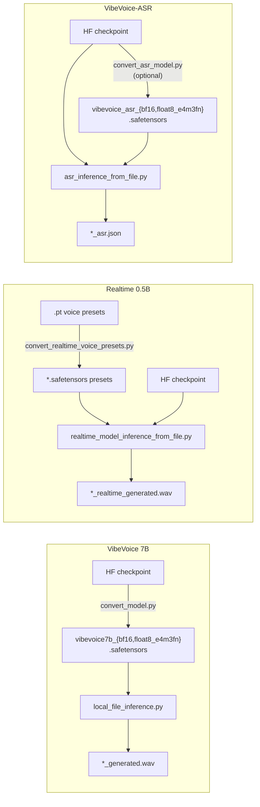

# Demo Model Tools

Command-line tools in `demo/` for running and converting the three VibeVoice models without the web UI.

| Model | Inference | Conversion |
|---|---|---|
| VibeVoice 7B (multi-speaker TTS) | `local_file_inference.py` | `convert_model.py` |
| VibeVoice-Realtime-0.5B (streaming TTS) | `realtime_model_inference_from_file.py` | `convert_realtime_voice_presets.py` (voice presets) |
| VibeVoice-ASR (speech recognition) | `asr_inference_from_file.py` | `convert_asr_model.py` |



## Before you start

Run every tool **from the repository root** with `PYTHONPATH=.`. Without it, the scripts fail with `ModuleNotFoundError: No module named 'config'`.

```bash
cd /path/to/vibevoice
PYTHONPATH=. python demo/<tool>.py --help
```

Expected model locations (the defaults used below):

| Model | Location | Source |
|---|---|---|
| VibeVoice 7B, converted | `./models/vibevoice/` | [zhaokun/vibevoice-large](https://huggingface.co/zhaokun/vibevoice-large) (`*.safetensors` + `config.json`) |
| Realtime 0.5B | `./models/VibeVoice-Realtime-0.5B/` | `microsoft/VibeVoice-Realtime-0.5B` on Hugging Face |
| ASR | `./models/VibeVoice-ASR/` | `microsoft/VibeVoice-ASR` on Hugging Face |

The Qwen text tokenizer ships with the repository (`tokenizer/`), so no tool downloads anything at run time.

---

## 1. `local_file_inference.py` — VibeVoice 7B TTS

Generates multi-speaker speech from a dialogue script, using the WAV voice samples in `demo/voices/`.

### Script format

One `Speaker N:` label per turn. Lines without a label continue the previous speaker's turn.

```text
Speaker 1: Hello, welcome to the show.
Speaker 2: Thanks for having me.
```

Samples are in `demo/text_examples/` (`1p_*` = one speaker, `2p_*` = two speakers, …).

### Example

```bash
PYTHONPATH=. python demo/local_file_inference.py \
    --model_file ./models/vibevoice/vibevoice7b_float8_e4m3fn.safetensors \
    --config ./models/vibevoice/config.json \
    --dtype float8_e4m3fn \
    --txt_path demo/text_examples/2p_short.txt \
    --speaker_names zh-007_man zh-007_woman \
    --output_dir ./outputs
```

### Arguments

| Argument | Default | Description |
|---|---|---|
| `--model_file` | `./models/converted/vibvoice7b_bf16.safetensors` | Converted single-file model (see `convert_model.py`). |
| `--config` | `./models/converted/config.json` | Model `config.json`. Pass `--config ""` to use the built-in default configuration instead. |
| `--dtype` | `bfloat16` | `bfloat16` or `float8_e4m3fn`. Must match the model file; any other value is treated as `bfloat16`. |
| `--txt_path` | `demo/text_examples/1p_abs.txt` | Dialogue script. |
| `--speaker_names` | `Andrew` | One voice per speaker, in order: the first name is used for `Speaker 1`, and so on. |
| `--output_dir` | `./outputs` | Where the WAV is written. |
| `--cfg_scale` | `1.3` | Classifier-free guidance. Lower values sound more natural; higher values follow the text more strictly. |
| `--lora_model_path` | none | LoRA `.safetensors` merged into the base model (weight 1.0). |
| `--seed` | `42` | Random seed. |
| `--device` | auto | Device for the inputs; see the note below. |

### Notes

- **Voice matching.** Each name in `--speaker_names` is matched against the WAV files in `demo/voices/`. A name matches by the full file stem (`en-Alice_woman`) or the short name (`Alice`), case-insensitively and allowing partial matches. If nothing matches, the first voice is used and a warning is printed.
- **GPU required in practice.** The model is always loaded onto CUDA; `--device` only moves the input tensors.
- **VRAM.** About 7 GB for FP8 and about 14 GB for bf16 (README figures). This script has no offloading option; the web UI does (see [offloading.md](offloading.md)).
- **Fixed settings.** The diffusion step count is fixed at 10, and decoding is greedy.
- **Output.** `<output_dir>/<txt name>_generated.wav`, plus a summary with tokens, generation time and RTF.

---

## 2. `convert_model.py` — convert the 7B TTS checkpoint

Turns an original Hugging Face VibeVoice 7B (Large) checkpoint into a single `.safetensors` file in bf16 or FP8, the format `local_file_inference.py` and the backend load.

You only need it if you start from the original checkpoint; the converted files from [zhaokun/vibevoice-large](https://huggingface.co/zhaokun/vibevoice-large) are ready to use.

```bash
PYTHONPATH=. python demo/convert_model.py \
    --model_path /path/to/VibeVoice-Large \
    --type float8_e4m3fn \
    --converted_model_name ./models/vibevoice/vibevoice7b
# -> ./models/vibevoice/vibevoice7b_float8_e4m3fn.safetensors
```

| Argument | Default | Description |
|---|---|---|
| `--model_path` | required | Original 7B checkpoint directory. Must contain `config.json`. |
| `--type` | `bfloat16` | `bfloat16` or `float8_e4m3fn`; any other value produces bf16. |
| `--converted_model_name` | `./vibvoice7b` | Output prefix; `_bf16.safetensors` or `_float8_e4m3fn.safetensors` is appended. |

The model is loaded onto CUDA before conversion, so the GPU must hold the full bf16 model. FP8 output needs an RTX 40-series or newer GPU at inference time.

---

## 3. `realtime_model_inference_from_file.py` — Realtime 0.5B TTS

Single-voice streaming TTS from plain text. It's much smaller than the 7B model and also runs on CPU.

### Example

```bash
PYTHONPATH=. python demo/realtime_model_inference_from_file.py \
    --model_path models/VibeVoice-Realtime-0.5B \
    --txt_path demo/text_examples/1p_abs.txt \
    --speaker_name Carter \
    --output_dir ./outputs
```

### Arguments

| Argument | Default | Description |
|---|---|---|
| `--model_path` | `models/VibeVoice-Realtime-0.5B` | Model directory (`config.json` + `model.safetensors`) or a single `.safetensors` file. |
| `--config` | `<model_path>/config.json` | Required file: this tool has no built-in default config. Pass it explicitly when `--model_path` is a single file. |
| `--txt_path` | required | Plain text, without `Speaker N:` labels. |
| `--speaker_name` | `Carter` | Voice preset: an exact stem (`en-Carter_man`) or a unique substring (`Carter`). |
| `--voices_dir` | `demo/voices/streaming_model` | Directory of converted `.safetensors` presets. |
| `--output_dir` | `./outputs` | Where the WAV is written. |
| `--device` | `cuda` if available, else `cpu` | |
| `--dtype` | bf16 on CUDA, fp32 on CPU | `bfloat16` or `float32`. |
| `--cfg_scale` | `1.5` | Classifier-free guidance. |
| `--ddpm_steps` | `5` | Diffusion steps per speech chunk; more steps are slower and may improve quality. |
| `--seed` | `42` | Random seed. |
| `--offload_layers_on_gpu` | off | Layer offloading: keep N of the 20 TTS layers on the GPU. |

### Notes

- **Voice presets.** 25 presets are already converted in `demo/voices/streaming_model/`, covering de, en, fr and other languages. If the name is ambiguous or unknown, the tool lists the available presets.
- **Output.** `<output_dir>/<txt name>_realtime_generated.wav`, plus generation time and RTF.

---

## 4. `convert_realtime_voice_presets.py` — Realtime voice presets

The Realtime model needs a precomputed voice prompt per voice. Upstream ships these as pickled `.pt` files (the `demo/voices/streaming_model/` folder of the upstream `microsoft/VibeVoice` GitHub repo). This tool converts them to `.safetensors`, the format the Realtime tool loads.

```bash
PYTHONPATH=. python demo/convert_realtime_voice_presets.py \
    --input /path/to/VibeVoice/demo/voices/streaming_model \
    --output_dir demo/voices/streaming_model
```

| Argument | Default | Description |
|---|---|---|
| `--input` | required | One `.pt` file, or a directory searched recursively. |
| `--output_dir` | `demo/voices/streaming_model` | Writes `<name>.safetensors`. |
| `--overwrite` | off | Re-convert presets that already exist (they are skipped otherwise). |

> **Security:** `.pt` files are unpickled during conversion, and unpickling can run code. Only convert presets from a trusted source. The converted `.safetensors` files are safe to share.

---

## 5. `asr_inference_from_file.py` — VibeVoice-ASR transcription

Transcribes audio into speaker-attributed, timestamped segments. Long audio is supported: anything over 60 s is encoded in 60 s segments.

> **Status:** algorithmic parity with upstream is verified on small random-weight models. Validation with the real checkpoint is still pending.

### Example

```bash
PYTHONPATH=. python demo/asr_inference_from_file.py \
    --model_path models/VibeVoice-ASR \
    --audio_files meeting.wav interview.mp3 \
    --context_info "Speakers: Alice, Bob. Topic: VibeVoice release" \
    --output_dir ./outputs
```

Console output (one line per segment):

```text
[0.00 - 3.52] Speaker 0: Welcome everyone to the weekly sync.
[3.80 - 7.10] Speaker 1: Thanks, Alice. Let's start with the release.
```

### Arguments

| Argument | Default | Description |
|---|---|---|
| `--model_path` | `models/VibeVoice-ASR` | HF directory (`model.safetensors.index.json` + shards) or a converted single file. |
| `--config` | `config.json` next to the model | Optional. Without it, the built-in ASR configuration is used. An explicit `--config` path must exist. |
| `--audio_files` | required | One or more files; any format `librosa` can read. Audio is resampled to 24 kHz mono and loudness-normalised. |
| `--context_info` | none | Hotwords, names or topic, added to the prompt to help with spelling and speaker naming. |
| `--output_dir` | `./outputs` | Where the JSON results are written. |
| `--device` | `cuda` if available, else `cpu` | |
| `--dtype` | checkpoint dtype | `bfloat16`, `float32` or `float8_e4m3fn`; the weights are cast at load time. |
| `--max_new_tokens` | `8192` | Maximum transcript length. Raise it for very long audio; upstream's CLI uses 32768. |
| `--temperature` | `0.0` | `0` is greedy decoding; above 0 enables sampling. |
| `--top_k` / `--top_p` | `50` / `1.0` | Sampling filters; ignored when greedy. |
| `--repetition_penalty` | `1.0` | Try about 1.05–1.1 if the output loops on long audio. |
| `--seed` | `42` | Reset for each file. The acoustic encoder adds random noise even when decoding greedily, so the seed matters for reproducibility. |
| `--offload_layers_on_gpu` | off | Layer offloading: keep N of the 28 LM layers on the GPU. |

### Output file

`<output_dir>/<audio name>_asr.json`:

```json
{
  "file": "meeting.wav",
  "audio_duration": 612.4,
  "raw_text": "[{\"Start time\": 0.0, ...}]",
  "segments": [
    {"start_time": 0.0, "end_time": 3.52, "speaker_id": 0, "text": "Welcome everyone to the weekly sync."}
  ],
  "generated_tokens": 1834,
  "reach_max_new_tokens": false,
  "encode_time": 2.1,
  "prefill_time": 1.4,
  "decode_time": 38.7
}
```

- If `reach_max_new_tokens` is `true`, the transcript was cut off: raise `--max_new_tokens`.
- If the model output isn't valid JSON, `segments` is empty and the console shows `raw_text`.

### Memory

The checkpoint has about 8.7B parameters (17.3 GB in bf16, per its index); the dropped acoustic decoder makes the loaded model slightly smaller. These figures are estimates, not measurements:

- weights take about 17 GB in bf16 and about 8.5 GB in FP8;
- long audio adds KV-cache memory, roughly 7.5 prompt tokens per second of audio, so 60 min is about 27k tokens.

If memory is short, use `--dtype float8_e4m3fn` (or a converted FP8 file) and/or `--offload_layers_on_gpu`.

---

## 6. `convert_asr_model.py` — convert the ASR checkpoint

Turns the sharded Hugging Face ASR checkpoint into one `.safetensors` file in bf16 or FP8. It's optional, because `asr_inference_from_file.py` reads the HF directory directly and can cast to FP8 at load time; a converted file just loads faster and is easier to copy around.

```bash
PYTHONPATH=. python demo/convert_asr_model.py \
    --model_path models/VibeVoice-ASR \
    --type float8_e4m3fn \
    --converted_model_name ./models/vibevoice_asr
# -> ./models/vibevoice_asr_float8_e4m3fn.safetensors

PYTHONPATH=. python demo/asr_inference_from_file.py \
    --model_path ./models/vibevoice_asr_float8_e4m3fn.safetensors \
    --audio_files meeting.wav
```

| Argument | Default | Description |
|---|---|---|
| `--model_path` | required | HF ASR directory. `config.json` is optional; the built-in config is used if it's missing. |
| `--type` | `bfloat16` | `bfloat16` or `float8_e4m3fn`. |
| `--converted_model_name` | `./vibevoice_asr` | Output prefix; `_bf16.safetensors` or `_float8_e4m3fn.safetensors` is appended. |
| `--device` | `cpu` | The conversion needs no GPU, but needs about 18 GB of free RAM (estimate) for the bf16 weights. |

The unused acoustic decoder weights (276 tensors) are dropped, so the converted file is smaller than the original checkpoint.

When you run the converted file from a directory that has no `config.json`, the inference tool falls back to the built-in config. Otherwise, pass `--config models/VibeVoice-ASR/config.json`.

---

## Troubleshooting

| Symptom | Cause / fix |
|---|---|
| `ModuleNotFoundError: No module named 'config'` | Run from the repository root with `PYTHONPATH=.` |
| `FileNotFoundError: ./models/converted/config.json` (7B) | Pass `--config <path>`, or `--config ""` for the built-in config. |
| `No voice presets in ...` (Realtime) | Convert the presets with `convert_realtime_voice_presets.py`, or point `--voices_dir` at them. |
| `Checkpoint mismatch` / `size mismatch` (ASR) | The config doesn't match the weights, e.g. the wrong `--config`. |
| `Prompt length ... exceeds the model context` (ASR) | Audio too long for the 131,072-token context; split the file. |
| CUDA out of memory | Use FP8 weights and/or `--offload_layers_on_gpu`; see [offloading.md](offloading.md). |
