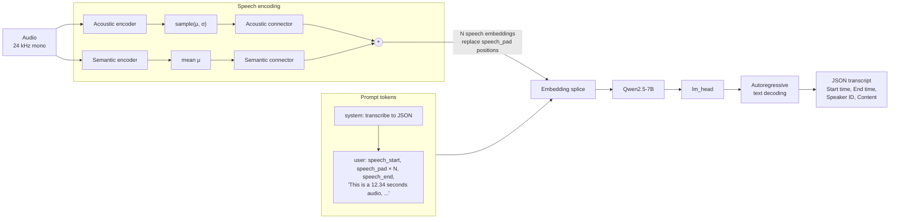
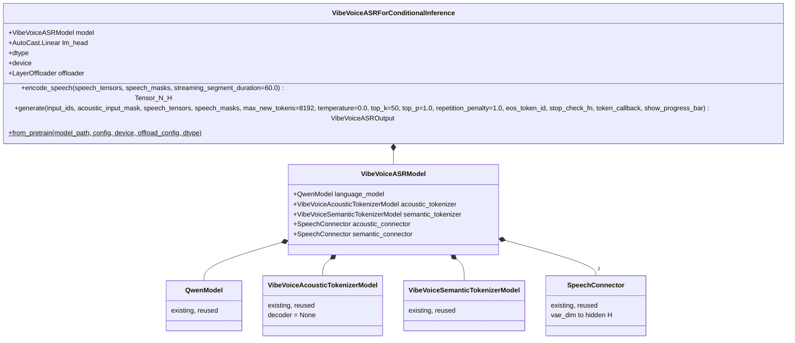
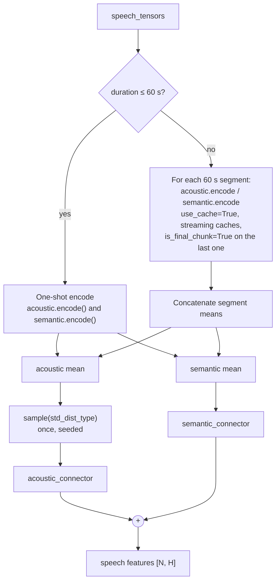
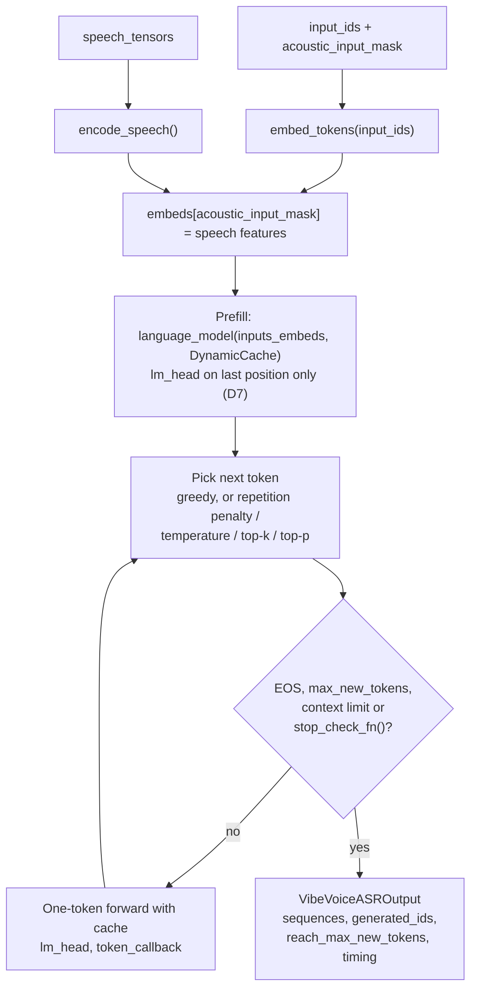

# VibeVoice-ASR Inference Integration — Design

| Field | Value |
| --- | --- |
| Status | Draft, awaiting review |
| Scope | Phase 1: model, processor, demo, tests (no backend / frontend) |
| Approach | Option A — local re-implementation on top of existing components, one backward-compatible change to the shared speech tokenizer |
| Upstream reference | `microsoft/VibeVoice` @ `875115c` (ASR added in `56cb11e`, 2026-01-21) |
| Model | `microsoft/VibeVoice-ASR` (7B) — **not downloaded yet**, see [Open Questions](#11-open-questions) |

## 1. Goal

Run VibeVoice-ASR (speech → structured transcript with speaker, timestamps and content) inside VibeVoiceFusion's own inference framework, so that it gets the same FP8 and layer-offloading support as the TTS models, **without changing the behaviour of any existing TTS (7B / Realtime 0.5B) code path and without upgrading `transformers` (stays at 4.51.3)**.

### Non-goals (this phase)

- Backend task / API / frontend (phase 2, separate design).
- Batch size > 1 (the GPU task queue is single-task anyway).
- ASR fine-tuning / LoRA.
- Gradio demo.
- Streaming text output to a UI (a callback hook is provided, but no consumer is built).

## 2. Background: what VibeVoice-ASR is

VibeVoice-ASR is the existing VibeVoice 7B architecture **without the diffusion head**, used in the opposite direction:

- One speech embedding per 3200 samples (7.5 Hz). 60 min of audio is about 27,000 speech positions, inside the 64K context the docs advertise.
- Audio over 60 s is encoded in 60 s segments with a streaming conv cache. Segmenting avoids the huge intermediate tensors a single 1-hour conv pass would create.
- Decoding is plain HF `generate`: greedy by default (`temperature=0`), optional sampling and `repetition_penalty`. Upstream's CLI demo now defaults to `max_new_tokens=32768`; this port defaults to 8192.
- Optional *context info* (hotwords, names, topics) is injected into the user prompt.
- Upstream declares `transformers>=4.51.3` for the `asr` extra, so 4.51.3 is a supported version and **no dependency upgrade is needed**.

## 3. Compatibility analysis

| ASR component (upstream) | Local equivalent | Reuse |
|---|---|---|
| `Qwen2Model` (7B) | `vibevoice/modular/modular_vibevoice_qwen.py::QwenModel` (FP8 via `AutoCast`) | as is |
| `lm_head` | `AutoCast.Linear` (same as 7B TTS) | as is |
| Acoustic tokenizer encoder | `modular_vibevoice_tokenizer.py::VibeVoiceAcousticTokenizerModel.encode` | as is (short audio); +`is_final_chunk` (long audio) |
| Semantic tokenizer encoder | `modular_vibevoice_tokenizer.py::VibeVoiceSemanticTokenizerModel.encode` | as is (short audio); +`is_final_chunk` (long audio) |
| `SpeechConnector` ×2 | `vibevoice/modular/modeling_vibevoice.py::SpeechConnector` | as is |
| `VibeVoiceTokenizerEncoderOutput.sample` | identical local class | as is |
| Layer offloading | `vibevoice/modular/custom_offloading_utils.py::LayerOffloader` | as is |
| `VibeVoiceASRConfig` | — | **new** |
| `VibeVoiceASRTextTokenizerFast` | — | **new** |
| `VibeVoiceASRProcessor` | — | **new** |
| `VibeVoiceASRForConditionalGeneration` + HF `generate` | — | **new**, hand-written decode loop |
| Diffusion head, DPM solver | exist locally | **not used** |

About 80% of the model is already present locally, with FP8 support. The new code is the glue: config, tokenizer, prompt construction, the encode → splice → decode loop, and the loader.

## 4. Design decisions

| # | Decision | Why |
|---|---|---|
| D1 | Plain `nn.Module` model, no `PreTrainedModel` / `GenerationMixin` | Same pattern as the 7B and Realtime models: keeps FP8 / offload / weight loading under our control and decoupled from `transformers` internals. |
| D2 | Hand-written decode loop (greedy + optional temperature / top-p / repetition penalty) | HF `GenerationMixin` needs `PreTrainedModel`. The loop is small (one prefill, then one token per step) and lets us add `stop_check_fn` and a progress callback like the TTS models. Logits processors come from `transformers.generation` (stable since well before 4.51) so sampling matches upstream. |
| D3 | Separate `VibeVoiceASRConfig` instead of reusing `VibeVoiceConfig` | The ASR `config.json` has `model_type: "vibevoice"`, same as TTS, and a `diffusion_head_config`, but the checkpoint has no diffusion head weights. `VibeVoiceConfig` would build a diffusion head that cannot be loaded, which is wrong. |
| D4 | Separate `VibeVoiceASRTextTokenizerFast` | ASR uses different special tokens (`<\|object_ref_start\|>`, `<\|object_ref_end\|>`, `<\|box_start\|>`; pad = `<\|image_pad\|>`) and a chat template. TTS uses `<\|vision_*\|>`. Changing the existing class would change TTS behaviour. Both use the bundled Qwen2.5-7B tokenizer files; upstream's ASR demo hard-codes `Qwen/Qwen2.5-7B`. |
| D5 | Add `is_final_chunk: bool = False` to the speech-tokenizer **encoder** path (the only edit to existing model code) | Required for audio over 60 s, and identical to upstream's change. With the default `False` every existing call is byte-for-byte unchanged (proved by a test, §8). The alternative (Option B) duplicates about 150 lines of conv-streaming code that would drift from upstream. |
| D6 | Batch size fixed to 1 | Local `QwenModel` passes `causal_mask=None` and relies on SDPA `is_causal`. That is correct for a prefill on an empty cache followed by single-token steps, which is exactly ASR batch=1. Batch > 1 needs left padding and a real mask; it's not needed for our single-GPU queue. |
| D7 | Compute logits only for the last position during prefill | Full-sequence logits for a 1-hour prompt: 27k × 152k × 4 B ≈ 16 GB. Last-position only: about 0.6 MB. |
| D8 | Don't build the acoustic **decoder** | ASR never decodes audio. Skipping it saves memory. If the checkpoint contains `acoustic_tokenizer.decoder.*` keys they go on an explicit ignore list. Any other missing or unexpected key is still a hard error, same as the Realtime loader. |
| D9 | Keep upstream's stochastic acoustic sampling (`std_dist_type`, usually `gaussian`) and seed it | Upstream samples the acoustic latent even at inference, so outputs depend on the RNG. We keep that for parity and expose `--seed`. We don't invent a "deterministic mean" mode; it can be added later if you want it. |
| D10 | Audio loading via existing `librosa` (already a dependency) | Upstream prefers an `ffmpeg` subprocess loader and falls back to `soundfile` + `librosa.resample`. We use `librosa.load(sr=24000, mono=True)` like the existing processor. Parity tests use 24 kHz WAV so the loader is not a variable. |

## 5. Detailed work

### 5.1 `config/configuration_vibevoice.py` — **add** `VibeVoiceASRConfig`

- Fields: `acoustic_tokenizer_config`, `semantic_tokenizer_config`, `decoder_config` (`QwenConfig`, `model_type == "qwen2"` only), `acoustic_vae_dim`, `semantic_vae_dim`, `torch_dtype`. Any other kwargs are kept as attributes (same convention as the existing configs).
- `from_dict(config_dict, **kwargs)` like the other configs. Any `diffusion_head_config` present in the file is ignored, not built.
- Append to `__all__`. No existing class or line is changed.

### 5.2 `vibevoice/modular/modular_vibevoice_text_tokenizer.py` — **add** `VibeVoiceASRTextTokenizerFast`

- Port of upstream's class: Qwen2 fast tokenizer + ASR special tokens + chat template + `speech_start_id / speech_end_id / speech_pad_id / pad_id / eos_id` properties.
- Loaded from the bundled `tokenizer/` directory with `local_files_only=True` (no network).
- Existing `VibeVoiceTextTokenizer*` classes untouched.

### 5.3 `vibevoice/modular/modular_vibevoice_tokenizer.py` — **backward-compatible** `is_final_chunk`

Thread `is_final_chunk: bool = False` through:

- `SConv1d.forward` → `SConv1d._forward_streaming`: when `True`, right-pad by `get_extra_padding_for_conv1d(...)` before the conv. This is the upstream logic, and the helper already exists locally.
- `TokenizerEncoder.forward_features` / `forward`.
- `VibeVoiceAcousticTokenizerModel.encode`, `VibeVoiceSemanticTokenizerModel.encode`.

Rules:

- Default `False` → no code path changes for existing callers, including the 7B TTS loop's per-step `semantic_tokenizer.encode(..., use_cache=True)`.
- The decoder side (`SConvTranspose1d`, `TokenizerDecoder`) is **not touched**.
- Local FP8 handling (`gamma` casts, `AutoCast` layers) is preserved; only the new parameter is added.

### 5.4 `vibevoice/modular/modeling_vibevoice_asr_inference.py` — **new**

Module and attribute names mirror upstream exactly (`model.language_model.*`, `model.acoustic_tokenizer.encoder.*`, `lm_head.weight`, …) so checkpoint keys load without remapping. This will be verified against the real index file.

**`encode_speech`** (same algorithm as upstream):

1. If length ≤ 60 s: non-streaming `acoustic.encode` → `sample(std_dist_type)` → connector, and `semantic.encode().mean` → connector.
2. If longer: iterate 60 s segments with two `VibeVoiceTokenizerStreamingCache`s, passing `is_final_chunk` on the last segment. Concatenate the means, sample the acoustic latent once, then apply the connectors.
3. Return `acoustic_features + semantic_features` (masked to the valid length).

**`generate`**:

1. `embeds = embed_tokens(input_ids)`; `embeds[acoustic_input_mask] = encode_speech(...)`.
2. Prefill: `language_model(inputs_embeds=embeds, past_key_values=DynamicCache())`, then `lm_head` on the **last position only** (D7).
3. Loop: pick next token (greedy, or sampling) using `transformers.generation` logits processors in HF `generate` order: repetition penalty, then temperature, top-k (HF default 50, which upstream never overrides), top-p → append → run a one-token forward with the cache.
4. Stop on EOS (`tokenizer.eos_token_id` = `<|endoftext|>`, as upstream passes; the checkpoint has no `generation_config.json`), on `max_new_tokens`, on context limit, or when `stop_check_fn()` returns `True`.
5. Return `sequences`, `generated_ids`, `reach_max_new_tokens`, and timing. Text decoding is left to `processor.decode(..., skip_special_tokens=True)`.

**`from_pretrain`** (mirrors the 7B / Realtime loaders):

- `init_empty_weights` → load `model.safetensors.index.json` (sharded HF checkpoint) or a single file.
- `load_state_dict(strict=False, assign=True)` with explicit missing / unexpected key checks (D8).
- The `model.acoustic_tokenizer.decoder.*` keys (276, unused by ASR) are dropped before loading.
- Optional `dtype` cast, applied to the state dict rather than via `model.to(dtype)` so the fp32 RoPE `inv_freq` buffer is not downcast. FP8 checkpoints load as stored, and FP8 embeddings are converted to bf16 when offloading (same handling as the 7B loader).
- Offload path: put everything except the LM decoder layers on the device, then create `LayerOffloader(language_model=model.model.language_model, ...)`. ASR has no prediction head, so `offload_prediction_head` is ignored.

### 5.5 `vibevoice/processor/vibevoice_asr_processor.py` — **new**

Port of upstream `VibeVoiceASRProcessor`, restricted to batch 1:

- Audio input: path (`librosa`, D10), `np.ndarray`, or `torch.Tensor`. Mono, 24 kHz, `AudioNormalizer` (existing class) when `normalize_audio`.
- Prompt: system prompt `"You are a helpful assistant that transcribes audio input into text output in JSON format."` + user turn `<speech_start> <speech_pad>×ceil(len/3200) <speech_end>\nThis is a {dur:.2f} seconds audio, [with extra info: {context}\n\n]please transcribe it with these keys: Start time, End time, Speaker ID, Content`. There is **no** assistant generation prompt: upstream accepts an `add_generation_prompt` flag but never forwards it to `apply_chat_template`. The text is reproduced **verbatim** from upstream: the model was trained on it.
- Returns `input_ids`, `attention_mask`, `acoustic_input_mask`, `speech_tensors`, `speech_masks`.
- `post_process_transcription(text)`: the upstream JSON extraction (code fence or first bracket match) and key mapping to `start_time / end_time / speaker_id / text`.
- `speech_tok_compress_ratio` read from `preprocessor_config.json` when present; the HF checkpoint ships none, so the loader default 3200 applies.

### 5.6 Tools

- `demo/asr_inference_from_file.py`: `--model_path`, `--audio_files …`, `--config`, `--context_info`, `--max_new_tokens`, `--temperature`, `--top_k`, `--top_p`, `--repetition_penalty`, `--seed`, `--device`, `--dtype`, `--offload_layers_on_gpu`, `--output_dir`. Prints segments and writes `{name}_asr.json` (raw text + segments + timing).
- `demo/convert_asr_model.py`: same as `demo/convert_model.py` but for ASR. Converts the HF sharded checkpoint into a mono `vibevoice_asr_{bf16|float8_e4m3fn}.safetensors`. Adds `--device` (default `cpu`; conversion needs no GPU).
- Both scripts treat `config.json` as optional, like the TTS loaders: when `<model_path>/config.json` is absent they fall back to `DEFAULT_ASR_CONFIG` (the released config without `diffusion_head_config`). An explicit `--config` path must exist. It's a new script because the existing one is hard-wired to `VibeVoiceConfig` / the TTS model, and changing it risks the TTS conversion flow.

## 6. Resource estimates

These are calculations from the Qwen2.5-7B shape (28 layers, 4 KV heads × 128, hidden 3584, vocab 152k), **not measurements**.

| Item | Size |
|---|---|
| LM + embeddings + `lm_head` weights, bf16 | ~15 GB (≈7.6 B params) |
| Acoustic + semantic encoders, bf16 | ~1–2 GB (unverified, depends on checkpoint) |
| KV cache, 1 h audio (~27k + ~4k generated tokens) | ~1.8 GB (57 KB / token) |
| Prefill MLP activation peak, 27k tokens | ~1 GB per intermediate tensor |
| Prefill logits with D7 | ~0.6 MB (vs ~16 GB without) |

- FP8 roughly halves the weights.
- Offloading N layers to CPU saves about N × 0.47 GB.
- Prefill attention over 27k tokens uses SDPA with `is_causal=True` and no explicit mask. That lets PyTorch pick the flash / memory-efficient kernel, so **`flash-attn` is not required** (upstream defaults to it but supports `sdpa`).

## 7. Why existing functionality is not affected

| Touch point | Change type | Guarantee |
|---|---|---|
| `config/configuration_vibevoice.py` | new class + `__all__` entry | existing classes not edited; import test |
| `modular_vibevoice_text_tokenizer.py` | new class | existing classes not edited; TTS token ids test |
| `modular_vibevoice_tokenizer.py` | new kwarg, default `False` | regression test: outputs with default args are bit-identical to `is_final_chunk=False`, in streaming and non-streaming mode, for both encoders |
| everything else | new files only | — |

- `transformers`, `torch` and all other dependencies stay unchanged.
- No backend, frontend, API or Docker change in this phase.

## 8. Test plan

### Local (CPU, `tests/test_asr.py`, class-based pytest like the existing tests)

1. **Config**: parse an ASR-shaped config; ignore `diffusion_head_config`; reject non-qwen2 decoders; `VibeVoiceConfig` unchanged.
2. **Tokenizer**: special token ids resolve to the expected existing vocab ids; chat template output; existing TTS tokenizer ids unchanged.
3. **Speech tokenizer regression**: tiny random encoders. Default call equals the `is_final_chunk=False` call (bit-exact), streaming and non-streaming.
4. **Streaming = non-streaming**: tiny random encoder, segmented encode with `is_final_chunk` on the last segment gives the same length as the one-shot encode, and close values. Upstream's claim is length alignment (ceil); value closeness will be measured, not assumed.
5. **Processor**: prompt text exactly equals upstream's format; `acoustic_input_mask.sum() == ceil(len/3200)`; context-info variant; JSON post-processing (code fence, bare array, malformed input → `[]`).
6. **Model structure**: meta-device build with the real config; key/shape match against the checkpoint index (skipped until the checkpoint exists).
7. **Generate (tiny random model)**: speech splice positions; greedy determinism; stop on EOS / `max_new_tokens` / `stop_check_fn`; last-position logits equal full-logits argmax; cache-based decode equals no-cache recompute.
8. **Parity with upstream (tiny random model)**: run upstream's `VibeVoiceASRForConditionalGeneration` from the local clone in a scratch script with the **same random weights** on CPU fp32. Compare speech features, prefill logits and greedy tokens. This proves algorithmic parity without the 7B weights (this machine has about 9 GB free RAM, not enough for a 7B fp32 run).
9. **Whole suite**: existing tests (`test_logging`, `test_lora_network`, `test_training_service`, `test_realtime_streaming`) still pass.

### Remote GPU (you, after phase 1)

1. `demo/asr_inference_from_file.py` on a short clip (< 60 s) and a long clip (> 10 min), bf16.
2. Same audio through upstream's `demo/vibevoice_asr_inference_from_file.py --attn_implementation sdpa`, same seed. Transcripts should match; small bf16 kernel differences are possible.
3. FP8 checkpoint via `demo/convert_asr_model.py`; check quality and VRAM.
4. `--offload_layers_on_gpu` at several values; check VRAM and speed.
5. Optionally, a one-command parity script I'll provide.

## 9. Files

| File | Status |
|---|---|
| `config/configuration_vibevoice.py` | modified (add class) |
| `vibevoice/modular/modular_vibevoice_text_tokenizer.py` | modified (add class) |
| `vibevoice/modular/modular_vibevoice_tokenizer.py` | modified (add default-off kwarg) |
| `vibevoice/modular/modeling_vibevoice_asr_inference.py` | new |
| `vibevoice/processor/vibevoice_asr_processor.py` | new |
| `demo/asr_inference_from_file.py` | new |
| `demo/convert_asr_model.py` | new |
| `tests/test_asr.py` | new |

Intentionally not touched: `modeling_vibevoice_inference.py`, `modeling_vibevoice.py`, `modular_vibevoice_qwen.py`, `custom_offloading_utils.py`, `util/float8_scale.py`, `demo/convert_model.py`, `backend/`, `frontend/`, `pyproject.toml`, `docs/APIs.md` (no endpoint change in phase 1).

## 10. Risks

| Risk | Impact | Mitigation |
|---|---|---|
| Checkpoint key names differ from upstream module names | load failure | Strict key check plus a meta-device key test once the index is available; remap table only if needed |
| FP8 on the conv encoders degrades transcripts | quality | Same approach already works for the TTS encoders; if ASR quality drops, keep encoders in bf16 (option on the converter) |
| Long prefill (27k tokens) memory on smaller GPUs | OOM | D7, offloading, FP8; document a recommended max duration per VRAM size after remote tests |
| Greedy decoding loops / repeats on long audio | quality | Expose `repetition_penalty` (upstream does); `max_new_tokens` cap |
| Output JSON truncated at `max_new_tokens` | partial transcript | Default 8192 (upstream CLI now uses 32768; raise it for very long audio); return `reach_max_new_tokens`; post-processing returns what parses |
| Stochastic acoustic sampling (D9) | run-to-run variation | Seeded; documented |

## 11. Open questions

These need the checkpoint or your decision.

- **Q1 — checkpoint files.** I need `config.json`, `model.safetensors.index.json`, `preprocessor_config.json` and `generation_config.json` from `microsoft/VibeVoice-ASR` to confirm:
  - key names;
  - whether acoustic decoder weights are included;
  - `speech_tok_compress_ratio`;
  - `max_position_embeddings`;
  - the tokenizer name;
  - the EOS set.

  The JSON files are small; the full weights are about 17 GB. Download only with your approval, or place them under `./models/VibeVoice-ASR`.
- **Q2 — default `max_new_tokens`.** Upstream CLI uses 512 (too short for long audio), Gradio uses 8192. Proposal: 8192.
- **Q3 — EOS tokens.** Upstream passes only `tokenizer.eos_token_id`, but HF `generate` also merges `generation_config.json`. I'll mirror whatever the checkpoint's `generation_config.json` declares.
- **Q4 — FP8 scope.** Convert everything (as the TTS converter does), or keep the speech encoders in bf16? Proposal: everything by default, with a flag to keep encoders in bf16; decide after the remote quality check.

## 12. Implementation status (phase 1)

Open questions resolved by the checkpoint in `models/VibeVoice-ASR` (`config.json` + index only, no weights loaded locally):

- **Q1**: 1177 checkpoint keys; 901 are used and match the model's `state_dict` exactly; the other 276 are acoustic decoder weights and are ignored. `max_position_embeddings` is 131072. There is no `preprocessor_config.json` or `generation_config.json`. The bundled Qwen2.5 tokenizer reproduces upstream token ids.
- **Q2**: `max_new_tokens` default 8192 (your decision).
- **Q3**: EOS is `tokenizer.eos_token_id` only (no `generation_config.json`).
- **Q4**: the converter casts everything, like the TTS converter. A "keep encoders in bf16" flag is not implemented; revisit after the remote quality check.

Local verification (CPU, tiny random models):

- `tests/test_asr.py` (34 tests) and the existing suite pass.
- A scratch parity script loaded the **same random weights** into this port and into upstream's `VibeVoiceASRForConditionalGeneration` (fp32, sdpa). Results:
  - speech features for one-shot and segmented encode: bit-identical;
  - generated tokens for greedy, greedy + repetition penalty, and seeded sampling: identical.
- One-shot vs segmented encode draws acoustic noise in a different memory layout (`randn_like` keeps the one-shot mean's permuted strides). This matches upstream: the two paths are statistically equivalent but not elementwise equal.
